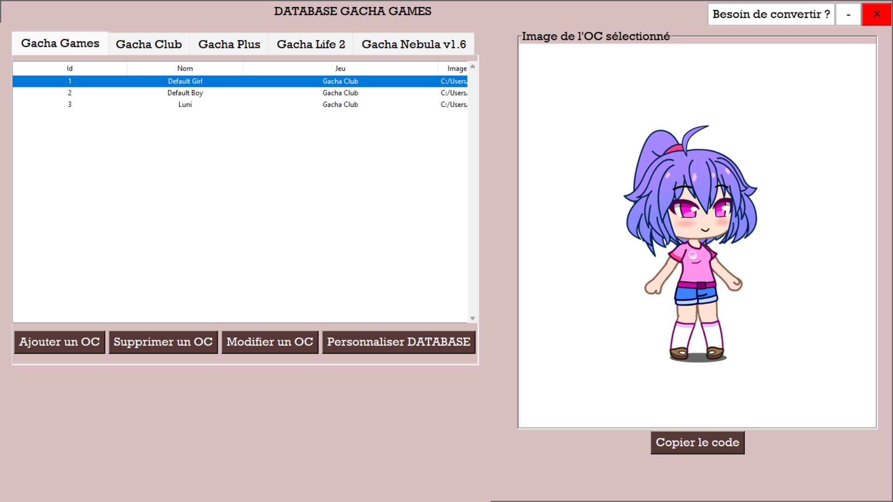

# Database Gacha Games FR

## Description: 
Un logiciel permettant de stocker les OC des jeux:
- Gache Club
- Gacha Plus
- Gacha Life 2
- Gacha Nebula v1.6

Le projet a commencé le 22/08/2026 et il se basait sur un projet existant de mon ordinateur.

---

## 📸 Aperçu


---

## 🚀 Fonctionnalités
- ✅ Ajout d'OC de différentes application
- ✅ Affichage de l'OC
- ✅ Possibilité de copier le code stocké

---

## 📌 **À propos du projet**
- **Backend** : Python
- **Frontend** : Python Tkinter
- **Database**: SQL et JSON

---

## 🤖 Utilisation de l'IA

Ce projet a été développé avec l'aide d'outils d'intelligence artificielle (Mistral AI).

**La contribution de l'IA** inclut :
- la création de la class FontChooserDialog avec quelques modifications personnelles
- une partie de mon apprentissage sur SQL
- la résolution d'erreurs non comprises
- des fonctionnalités spécifiques 

## Utilisation

Prérequis:
- python
- tkinter
- color-contrast
- colour
- pathlib
- pyperclip

1. Cloner le dépôt :
     ```bash
     git clone https://github.com/Gachadev-Aria/Database-Gacha-Games-FR.git
  Ou:
  Télécharger le [fichier zip.](https://github.com/Gachadev-Aria/Database-Gacha-Games-FR/archive/refs/heads/main.zip)
  
2. Dans la console de votre ordi:
    ```bash
    cd Database-Gacha-Games-FR
    python -mvenv venv
    python run.py

---
## 📧 Contact

Vous pouvez me contacter par mail: aria.and.idriss@gmail.com
